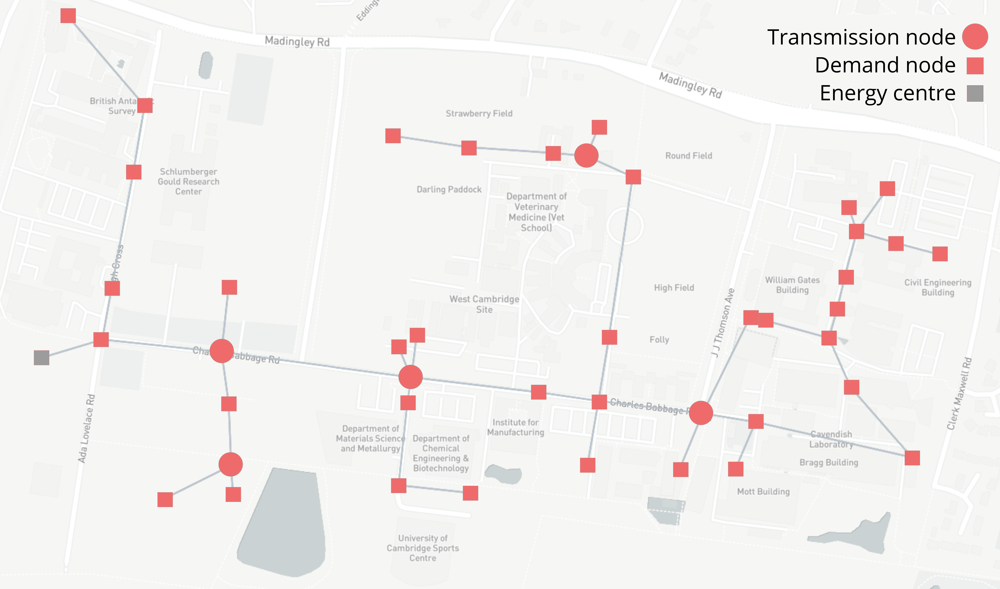

# Cambridge Calliope
Calliope model, specific to a district development in Cambridge, UK.

For more information on the model structure and general use of Calliope, see [the documentation](https://calliope.readthedocs.io/en/stable/).



This model has been used in the following paper: `(Under review) B. Pickering, R. Choudhary. District energy system optimisation under uncertain demand: handling data-driven stochastic profiles, Applied Energy (2018)`

If you use this model or work derived from it in an academic publication, please cite the above paper.

## Install

This paper ran on a development version of Calliope 0.6.3. To install, download the `DMUU.yml` requirements file found in the `requirements` directory of this repository. Install it by using the Calliope development environment instructions:

```shell
$ conda env create -f DMUU.yml
```

## Running models

The notebook 'DMUU' will guide you through building the model.

## Notes

* Native Calliope plotting will not work in most cases, due to the existence of the 'scenario' dimension.

## License

[](https://creativecommons.org/licenses/by-sa/4.0/)

This work is licensed under a [Creative Commons Attribution-ShareAlike 4.0 International License](http://creativecommons.org/licenses/by-sa/4.0/).